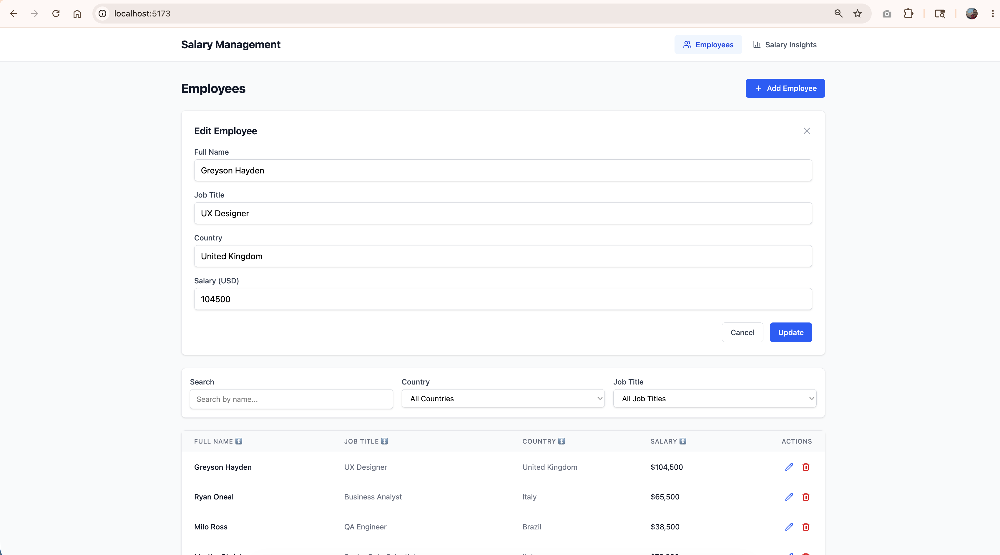
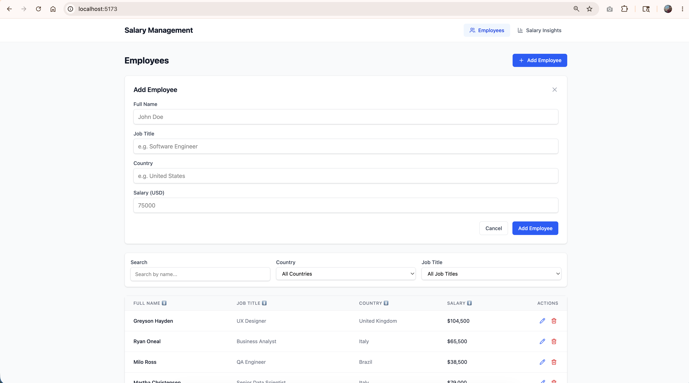
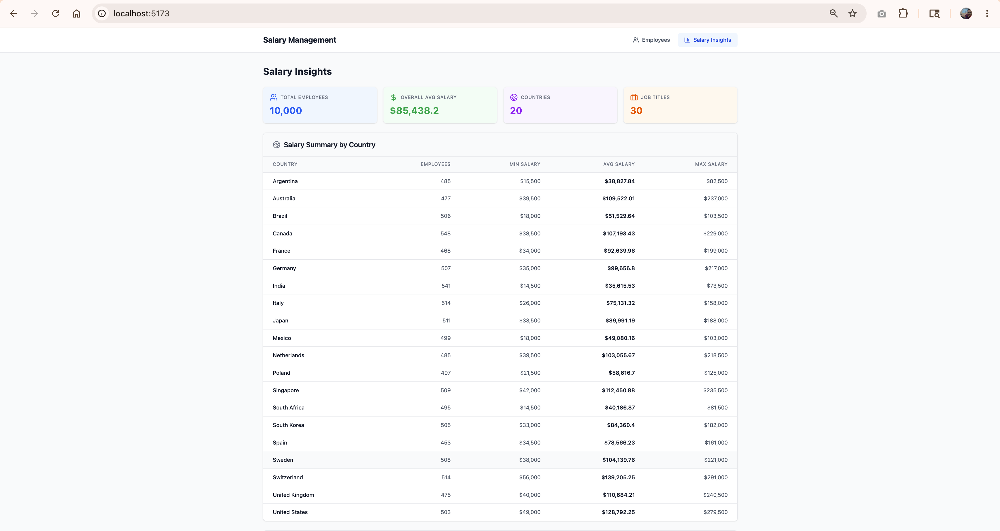

# Salary Management System

A production-quality full-stack web application for managing 10,000 employees with salary analytics. Built with React, Express, Prisma, and SQLite.







---

## Features

### Employee Management
- **Full CRUD** — Create, read, update, delete employees via UI
- **Search** — Real-time debounced search by employee name (300ms)
- **Filters** — Filter by country and job title dropdowns
- **Sorting** — Sort by any column (name, job title, country, salary)
- **Pagination** — 20 records per page with Previous/Next navigation
- **Inline Edit** — Modal form with pre-filled data and validation
- **Delete Confirmation** — Two-click delete to prevent accidental removal

### Salary Insights
- **Summary Cards** — Total employees, overall average salary, countries, job titles
- **Country Table** — Min, max, and average salary for each of 20 countries
- **Job Title Table** — Average salary by job title with pagination (20 per page)
- **Sortable Columns** — Click any header to sort by job title, country, employees, or avg salary
- **Search & Filter** — Text search on job title/country, filter by specific country
- **In-Memory Cache** — 60-second TTL cache on all aggregate queries

---

## Tech Stack

| Layer | Technology |
|---|---|
| Frontend | React 19 + Vite + TypeScript |
| UI | Tailwind CSS v4 + Lucide React icons |
| State | TanStack React Query |
| Backend | Node.js + Express + TypeScript |
| ORM | Prisma |
| Database | SQLite (WAL mode enabled) |
| Testing | Vitest + React Testing Library (frontend) / Jest + Supertest (backend) |

---

## Prerequisites

- Node.js 18+
- npm

---

## Quick Start

### 1. Clone and install dependencies

```bash
git clone https://github.com/manavpandya/Salary-Management-System---MERN-Stack.git
cd Salary-Management-System---MERN-Stack

# Backend
cd backend
npm install

# Frontend
cd ../frontend
npm install
```

### 2. Configure environment

```bash
# backend/.env (already configured for local development)
DATABASE_URL="file:./prisma/dev.db"
PORT=3001
```

### 3. Run database migrations

```bash
cd backend
npx prisma migrate dev
```

### 4. Seed the database (10,000 employees)

```bash
cd backend
npm run db:seed
```

### 5. Start the application

**Terminal 1 — Backend:**
```bash
cd backend
npm run dev
# → Server running on http://localhost:3001
```

**Terminal 2 — Frontend:**
```bash
cd frontend
npm run dev
# → http://localhost:5173 (API proxied to localhost:3001)
```

---

## Running Tests

```bash
# Backend — 19 tests (CRUD, validation, pagination, sorting, insights)
cd backend
npm test

# Frontend — 5 tests (form render, validation, submit, pre-fill, cancel)
cd frontend
npx vitest run

# Frontend build check
cd frontend
npx vite build
```

---

## API Endpoints

### Employees
| Method | Endpoint | Description |
|---|---|---|
| GET | `/api/employees` | List with pagination, search, filter, sort |
| GET | `/api/employees/:id` | Get single employee |
| POST | `/api/employees` | Create employee (validated via Zod) |
| PUT | `/api/employees/:id` | Update employee |
| DELETE | `/api/employees/:id` | Delete employee |
| GET | `/api/employees/countries` | Distinct countries list |
| GET | `/api/employees/job-titles` | Distinct job titles list |

### Insights
| Method | Endpoint | Description |
|---|---|---|
| GET | `/api/insights/by-country` | Min/max/avg salary per country |
| GET | `/api/insights/by-job-title` | Paginated avg salary by job title (`?country=&page=&limit=`) |
| GET | `/api/insights/stats` | Overall stats (total employees, avg salary, counts) |

### Query Parameters for `GET /api/employees`
| Param | Type | Default | Description |
|---|---|---|---|
| `page` | number | 1 | Page number (max 1000) |
| `limit` | number | 20 | Items per page (max 100) |
| `search` | string | — | Full name search (sanitized, max 100 chars) |
| `country` | string | — | Filter by exact country |
| `jobTitle` | string | — | Filter by exact job title |
| `sortBy` | string | `createdAt` | Sort field |
| `sortOrder` | string | `desc` | Sort direction |

### Health Check
| Method | Endpoint | Description |
|---|---|---|
| GET | `/health` | Server health status |

---

## Project Structure

```
salary_management_system_mern_stack/
├── backend/
│   ├── data/                 # first_names.txt, last_names.txt
│   ├── prisma/
│   │   ├── schema.prisma     # Database schema with indexes
│   │   ├── migrations/       # Prisma migrations
│   │   └── seed.ts           # Seed 10,000 employees (batch size 2000)
│   ├── src/
│   │   ├── app.ts            # Express app with middleware stack
│   │   ├── controllers/      # Request handlers
│   │   ├── services/         # Business logic (prisma.ts singleton)
│   │   ├── routes/           # Route definitions
│   │   ├── middleware/       # Zod validation, error handler
│   │   ├── validators/       # Zod schemas (create, update, list)
│   │   └── types/            # TypeScript interfaces
│   └── tests/                # 19 API tests (Jest + Supertest)
│
├── frontend/
│   ├── src/
│   │   ├── api/              # Shared Axios client + API functions
│   │   ├── hooks/            # React Query hooks (employees, insights)
│   │   ├── components/       # ErrorBoundary, EmployeeTable, EmployeeForm, EmployeeFilters
│   │   ├── pages/            # EmployeesPage, InsightsPage
│   │   └── types/            # TypeScript interfaces
│   └── tests/                # 5 component tests (Vitest + RTL)
│
├── AI_USAGE.md               # Prompts, decisions, tradeoffs
└── README.md                 # This file
```

---

## Performance Considerations

| Concern | Solution |
|---|---|
| 10k employee queries | Composite index on `(country, jobTitle)` for fast aggregations |
| Pagination depth | Page capped at 1000 to prevent deep OFFSET degradation |
| Aggregate queries | In-memory TTL cache (60s) for insights endpoints |
| Debounced search | 300ms debounce prevents excessive API calls |
| Batch seeding | 2,000 records per batch for fast, safe seeding |
| SQLite concurrency | WAL mode enabled for concurrent read performance |
| Request timeout | 30s timeout middleware prevents hung requests |

---

## Security

- **Input sanitization** — Search input sanitized (control chars stripped, max 100 chars)
- **Sort parameter whitelist** — Only valid column names accepted in `sortBy`
- **JSON body limit** — Express limited to 1MB payloads
- **CORS configurable** — `CORS_ORIGIN` env variable (defaults to `*` for dev)
- **No hardcoded secrets** — All config via environment variables

---

## Deployment

### Backend (Railway / Render)
1. Set environment variables: `DATABASE_URL`, `PORT`, `CORS_ORIGIN`
2. Run `npx prisma migrate deploy` on startup
3. Run `npx ts-node prisma/seed.ts` for initial data

### Frontend (Vercel / Netlify)
1. Set build command: `npm run build`
2. Set output directory: `dist`
3. Configure proxy rewrite: `/api/*` → backend URL

---

## Environment Variables

| Variable | Required | Default | Description |
|---|---|---|---|
| `DATABASE_URL` | Yes | `file:./prisma/dev.db` | SQLite database path |
| `PORT` | No | `3001` | Backend server port |
| `CORS_ORIGIN` | No | `*` | Allowed CORS origin |

---

## License

ISC